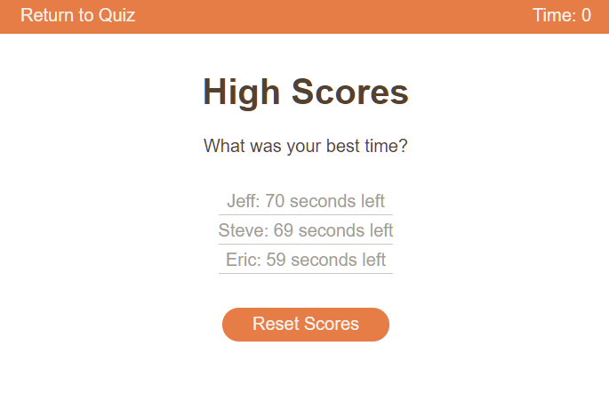

# Coding-Quiz
A multiple-choice quiz to test your (beginner) JavaScript coding knowledge!

## Description
This coding quiz was a created to push my JavaScript and DOM manipulation skills.
It has the following features:
- A streamlined UI with reactive buttons
- Randomized questions with answer bubbles presented in random order
- A working timer that reduces in value with each incorrect answer
- A high-score submission form 
- A separate high-score page:
    - Local storage saving and retrieval
    - Dynamic leaderboard generated from local storage values
- Dynamic design that changes to match your viewport

## Installation
N/A

## Usage

See the published site: [here](https://stevengoldbergm.github.io/Coding-Quiz/)
- To use the webpage, you can click the "Start Quiz" button to start the quiz, or the "View High Scores" link to view the High Scores page

- Upon clicking "Start Quiz!"
    - 5 different quiz questions will be shown in random order
        - Click on the correct answer to move to the next question
        - Clicking on an incorrect answer will reduce the timer by 10 seconds
    - If you finish the quiz, enter your name in the input field and press [Enter] (or click the button) to save your score to local memory

- Upon clicking "View High Scores"
    - Click "Reset Scores" to clear any high scores from local memory
    - Click "Return to Quiz" to navigate back to the main quiz page.

## Images 

## License
N/A

